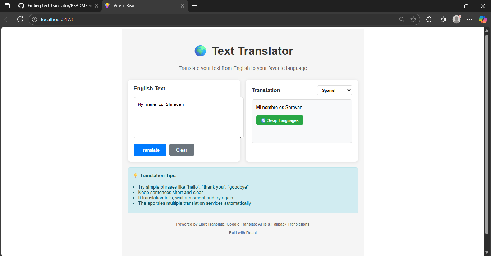

# 🌍 Text Translator App

A modern React-based text translator that converts English text to 15+ languages using multiple translation APIs with automatic fallback.

## ✨ Features

- **15+ Languages**: Spanish, French, German, Italian, Portuguese, Russian, Japanese, Korean, Chinese, Arabic, Hindi, Turkish, Dutch, Polish, Swedish
- **Smart Fallback**: LibreTranslate → Google Translate → Built-in translations
- **Responsive Design**: Works on desktop, tablet, and mobile
- **Offline Support**: Built-in translations work without internet

## 🚀 Quick Start

```bash
# Clone and install
git clone https://github.com/yourusername/text-translator.git
cd text-translator
npm install

# Run development server
npm run dev

# Build for production
npm run build
```

Open [http://localhost:5173](http://localhost:5173) to view the app.

## 📱 Usage

1. Type English text in the left textarea
2. Select target language from dropdown
3. Click "Translate" button
4. View translation in the right panel

## 🔧 How It Works

- **Tier 1**: LibreTranslate APIs (3 endpoints for redundancy)
- **Tier 2**: Google Translate API (fallback)
- **Tier 3**: Built-in common phrases (offline)

## 🛠️ Built With

- **React 18** + **Vite**
- **JavaScript ES6+**
- **Multiple Translation APIs**
- **Responsive CSS**

## 📸 Screenshot



*Your working Text Translator App - Click to view full size*

## 🤝 Contributing

1. Fork the repository
2. Create feature branch (`git checkout -b feature/amazing`)
3. Commit changes (`git commit -m 'Add amazing feature'`)
4. Push to branch (`git push origin feature/amazing`)
5. Open Pull Request

## 📄 License

MIT License - see [LICENSE](LICENSE) file for details

---

**Happy Translating! 🌍✨**
